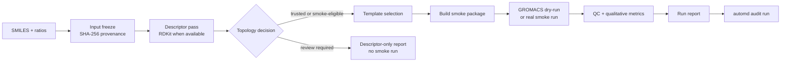
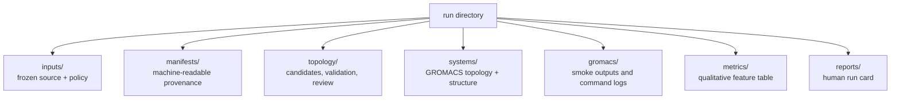
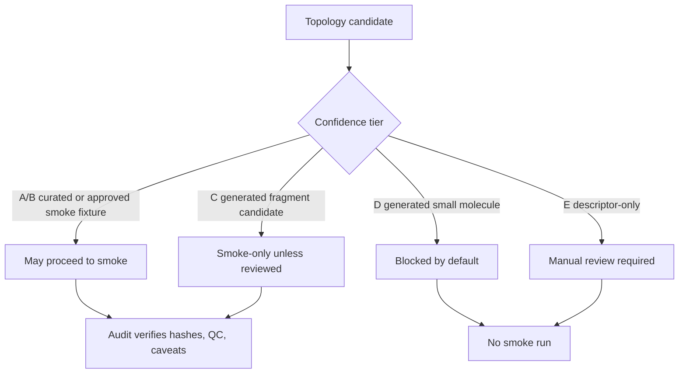

# AutoMD

**SMILES + ratios in. Auditable Martini 3 + GROMACS smoke packages out.**

AutoMD is a standalone Python CLI for preparing mostly automated coarse-grained molecular dynamics run packages. Give it the starting SMILES for a formulation and the component ratios; it freezes the input, computes descriptors, resolves or blocks topology choices, builds a smoke-test system, runs QC, extracts qualitative metrics, and writes a human-readable report.

> AutoMD is intentionally conservative. A passing smoke run is workflow evidence, not wet-lab validation or production scientific proof. Placeholder and generated topologies must be replaced with licensed, reviewed Martini topology assets before production use.

---

## Why It Exists

AutoMD is built for the annoying middle layer between "I have a formulation idea" and "I have a reproducible simulation package I can inspect."

| You provide | AutoMD prepares | You review |
|---|---|---|
| SMILES strings | frozen inputs and hashes | what was actually simulated |
| component ratios | descriptor and topology manifests | which topology tier was selected |
| optional policy | GROMACS-ready smoke package | QC, metrics, and caveats |
| optional real GROMACS | Markdown report and audit trail | blockers before production |

---

## The Flow



AutoMD's default path is designed to be useful before everything is perfect. If a molecule cannot be safely mapped to a smoke-eligible topology, the pipeline does not silently pretend it is ready. It writes a blocked descriptor-only report with the next review action.

---

## Quick Start

Install in editable mode:

```bash
python -m pip install -e ".[test]"
```

Run the automated lane from only SMILES and ratios:

```bash
automd auto "CCO:50,CCCCCCCCCCCC:50" --out runs/auto_demo
```

Open the generated guide for that run:

```bash
open runs/auto_demo/reports/run_report.md
```

Audit the run package:

```bash
automd audit run runs/auto_demo
```

Expected high-level output:

```text
runs/auto_demo/
  inputs/
  manifests/
  topology/
  systems/
  gromacs/
  metrics/
  images/
  reports/run_report.md
```

---

## Real GROMACS Smoke Run

Dry-run mode is enough to verify the pipeline shape. To execute a tiny real GROMACS smoke run, install GROMACS and use `--real-gromacs`:

```bash
mamba install -y -c conda-forge gromacs
automd auto "CCCCCCCCCCCCN(CCCCCCCC)CCCCCCCC:100" \
  --out runs/real_smoke_demo \
  --real-gromacs
automd audit run runs/real_smoke_demo
```

For production interpretation, read [docs/production_setup.md](docs/production_setup.md) first.

---

## What AutoMD Writes



Key files:

| File | Purpose |
|---|---|
| `inputs/raw_auto_input.txt` | exact user input captured for replay |
| `manifests/automation_manifest.yaml` | automation policy, decisions, blockers |
| `manifests/descriptor_manifest.yaml` | descriptor coverage and per-component status |
| `topology/topology_candidates.yaml` | topology options and confidence tiers |
| `manifests/topology_review_manifest.yaml` | selected topology path or descriptor-only decision |
| `manifests/smoke_run_manifest.yaml` | GROMACS command provenance and version capture |
| `manifests/qc_manifest.yaml` | QC status and failure classes |
| `manifests/metrics_manifest.yaml` | qualitative computed metrics |
| `reports/run_report.md` | readable summary for review |

---

## Safety Model



AutoMD separates **smoke eligibility** from **production eligibility**:

- Smoke eligibility means a run package can be generated to test workflow mechanics.
- Production eligibility requires curated, licensed, reviewed topology files.
- Generated or placeholder topologies are not production-approved just because a dry run completed.
- `automd audit run` verifies required artifacts, hashes, `-maxwarn 0`, qualitative metric flags, QC status, and report caveats.

---

## CLI Cheat Sheet

### One-command automation

```bash
automd auto "SMILES_A:70,SMILES_B:30" --out runs/my_formulation
```

Useful flags:

| Flag | Use |
|---|---|
| `--real-gromacs` | run real GROMACS smoke execution instead of dry-run artifacts |
| `--allow-triage` | allow review-required generated candidates to proceed only under triage policy |
| `--policy configs/automation_policy.yaml` | use a custom automation policy |

### Stage-by-stage workflow

```bash
automd env doctor
automd intake examples/demo_lnp_001.yaml --out runs/demo_lnp_001
automd descriptors run runs/demo_lnp_001/manifests/intake_manifest.yaml
automd topology generate runs/demo_lnp_001/manifests/descriptor_manifest.yaml
automd review topology runs/demo_lnp_001/topology/topology_candidates.yaml
automd templates recommend runs/demo_lnp_001/manifests/topology_review_manifest.yaml
automd build smoke runs/demo_lnp_001/manifests/template_manifest.yaml --builder mock
automd gromacs preflight runs/demo_lnp_001/manifests/build_manifest.yaml
automd simulate smoke runs/demo_lnp_001/manifests/build_manifest.yaml --dry-run
automd qc smoke runs/demo_lnp_001/manifests/smoke_run_manifest.yaml
automd metrics extract runs/demo_lnp_001/manifests/qc_manifest.yaml
automd report run runs/demo_lnp_001
automd audit run runs/demo_lnp_001
```

### Batch mode

```bash
automd batch plan examples/batch_formulations.csv --out runs/batch_demo
automd batch smoke runs/batch_demo/batch_plan.yaml --dry-run
automd batch summarize runs/batch_demo
```

---

## Interpreting Results

| Result | Meaning | Next action |
|---|---|---|
| `audit status: pass` | package is internally consistent and smoke/audit gates passed | review report and caveats |
| `descriptor_only` | AutoMD stopped before smoke because topology review is required | resolve or curate topology |
| `qc_status: fail` | smoke execution or output checks failed | inspect command logs and topology/build artifacts |
| `qualitative_only: true` | metrics are computed first-pass features | do not treat as validated prediction |

---

## Documentation Map

| Topic | Read this |
|---|---|
| full SMILES + ratio automation | [docs/full_automation.md](docs/full_automation.md) |
| topology generation tiers | [docs/automated_topology_generation.md](docs/automated_topology_generation.md) |
| automation policy | [docs/automation_policy.md](docs/automation_policy.md) |
| input schemas | [docs/input_contracts.md](docs/input_contracts.md) |
| GROMACS and production setup | [docs/production_setup.md](docs/production_setup.md) |
| QC and metrics caveats | [docs/qc_and_metrics.md](docs/qc_and_metrics.md) |
| simulation templates | [docs/simulation_templates.md](docs/simulation_templates.md) |
| topology registry | [docs/topology_registry.md](docs/topology_registry.md) |

---

## Non-Goals

AutoMD does not:

- turn arbitrary SMILES into validated Martini topologies without curation,
- claim smoke or dry-run success is experimental validation,
- remove the need for scientific review,
- make placeholder topology fixtures production-ready,
- bypass GROMACS/topology errors with unreviewed `maxwarn` settings.

---

## Development Checks

```bash
ruff check automd tests scripts
python -m compileall -q automd tests scripts
pytest -q
```

The project is intentionally small and inspectable. The best confidence signal is a run directory that passes both its smoke/QC path and `automd audit run`.
